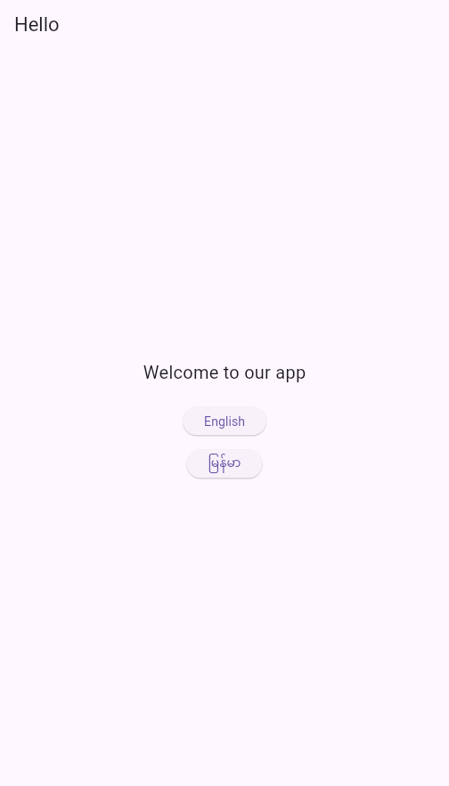
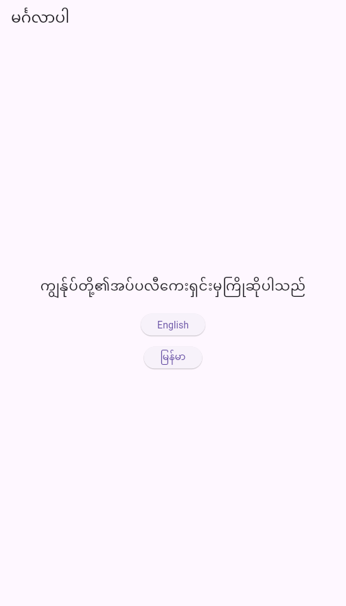

# Flutter Riverpod 2: Implementing a Language Switcher with Persistence

In this guide, we’ll walk through how to implement a language switcher in a Flutter app using Riverpod 2 and shared_preferences. This allows your users to toggle between languages (e.g., English and Myanmar), and the selection persists even after the app restarts.

## What You'll Learn
- How to manage app language (locale) state using Riverpod 2.
- How to switch between languages in the UI.
- How to persist the selected language using shared_preferences.
- How to apply the selected language across the entire app using MaterialApp.


## Add Dependencies
In your pubspec.yaml, add:

```yaml
dependencies:
  flutter:
    sdk: flutter
  cupertino_icons: ^1.0.8
  flutter_localizations:
    sdk: flutter
  flutter_riverpod: ^2.6.1
  shared_preferences: ^2.5.3
  intl: ^0.19.0
  .
  .
```

## Create the Locale Notifier
```dart
// locale_notifier.dart
import 'package:flutter/material.dart';
import 'package:flutter_riverpod/flutter_riverpod.dart';
import 'package:shared_preferences/shared_preferences.dart';

class LocaleNotifier extends StateNotifier<Locale> {
  static const _localeKey = 'app_locale';

  LocaleNotifier() : super(const Locale('en')) {
    _loadSavedLocale();
  }

  // Load saved locale from shared preferences
  Future<void> _loadSavedLocale() async {
    final prefs = await SharedPreferences.getInstance();
    final localeCode = prefs.getString(_localeKey);
    if (localeCode != null) {
      state = Locale(localeCode);
    }
  }

  // Set and persist new locale
  Future<void> changeLocale(Locale newLocale) async {
    state = newLocale;
    final prefs = await SharedPreferences.getInstance();
    await prefs.setString(_localeKey, newLocale.languageCode);
  }
}

// The provider
final localeProvider = StateNotifierProvider<LocaleNotifier, Locale>((ref) {
  return LocaleNotifier();
});

```

## Configure `main.dart`
```dart
// lib/main.dart
import 'package:flutter/material.dart';
import 'package:flutter_riverpod/flutter_riverpod.dart';
import 'package:flutter_gen/gen_l10n/app_localizations.dart';
import 'package:flutter_localizations/flutter_localizations.dart';
import 'locale_provider.dart';
import 'home_page.dart';

void main() {
  runApp(const ProviderScope(child: MyApp()));
}

class MyApp extends ConsumerWidget {
  const MyApp({super.key});

  @override
  Widget build(BuildContext context, WidgetRef ref) {
    final locale = ref.watch(localeProvider);

    return MaterialApp(
      debugShowCheckedModeBanner: false,
      locale: locale,
      supportedLocales: AppLocalizations.supportedLocales,
      localizationsDelegates: const [
        AppLocalizations.delegate,
        GlobalMaterialLocalizations.delegate,
        GlobalWidgetsLocalizations.delegate,
        GlobalCupertinoLocalizations.delegate,
      ],
      home: const HomePage(),
    );
  }
}

```


## Build the Language Switcher UI
```dart
import 'package:flutter/material.dart';
import 'package:flutter_riverpod/flutter_riverpod.dart';
import 'package:flutter_gen/gen_l10n/app_localizations.dart';
import 'locale_provider.dart';

class HomePage extends ConsumerWidget {
  const HomePage({super.key});

  @override
  Widget build(BuildContext context, WidgetRef ref) {
    final localeNotifier = ref.read(localeProvider.notifier);

    return Scaffold(
      appBar: AppBar(
        title: Text(AppLocalizations.of(context)!.title),
      ),
      body: Center(
        child: Column(
          mainAxisAlignment: MainAxisAlignment.center,
          children: [
            Text(
              AppLocalizations.of(context)!.welcome,
              style: const TextStyle(fontSize: 20),
            ),
            const SizedBox(height: 24),


            ElevatedButton(
              onPressed: () => localeNotifier.changeLocale(const Locale('en')),
              child: const Text('English'),
            ),
            const SizedBox(height: 16),
            ElevatedButton(
              onPressed: () => localeNotifier.changeLocale(const Locale('my')),
              child: const Text('မြန်မာ'),
            ),
          ],
        ),
      ),
    );
  }
}

```

## Generate Localization Files
```bash
flutter gen-l10n
flutter pub get 
```
## What is a .arb file in Flutter?
`.arb` stands for Application Resource Bundle. It's a JSON-based file format used in Flutter for localization (i18n).

These files:
- Contain translated strings for your app
- Are processed by Flutter’s localization tool to generate Dart code (like AppLocalizations)
- Allow easy translation to multiple languages

Example structure:
```json
{
  "@@locale": "en",
  "title": "My App",
  "welcome": "Welcome!"
}
```


## Final Result
Users see a UI with language buttons.

Tapping "မြန်မာ" changes the app language to Burmese.

The app remembers the choice even after restart.





## Github link 
[Source code](https://github.com/aungthuoo/flutter-riverpod-change-language)